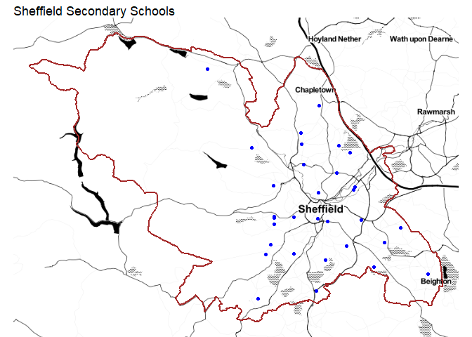
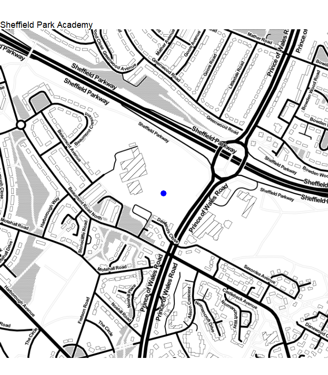

## Secondary schools

The first thing to do, is get the secondary school features we want to
create isochrones for. I’ve made some [notes about the Council’s
GIS](https://scc-pi.github.io/notes/gis.html#gis), and more specifically
about the [R-ArcGIS
Bridge](https://scc-pi.github.io/notes/gis.html#r-arcgis-bridge) that is
used below to get the data from the Council’s web GIS.

``` r
# URL for secondary schools from the Council's Portal (without a token!)
secondary_schools_url  <- str_c(
  "https://sheffieldcitycouncil.cloud.esriuk.com",
  "/server/rest/services/AGOL/Education/FeatureServer/3")

# Get secondary schools as simple features with WSG84 coordinates
sf_secondary_schools <- arc.open(secondary_schools_url) %>% 
  arc.select() %>% 
  arc.data2sf() %>% 
  st_transform(crs = 4326)

# URL for the city boundary from the Council's AGOL Open Data
city_boundary_url  <- str_c(
  "https://utility.arcgis.com/usrsvcs/servers/4cdfd020c6f54581a3065c734535adab",
  "/rest/services/AGOL/OpenData/MapServer/11")

# Get the city boundary as a simple feature with WSG84 coordinates 
sf_city_boundary <- arc.open(city_boundary_url) %>% 
  arc.select() %>% 
  arc.data2sf() %>% 
  st_transform(crs = 4326)

# Get the bounding box (coordinates) for Sheffield
shef_bbox <- st_buffer(sf_city_boundary, 1000) %>% 
  st_bbox() %>%
  as.numeric()

# Get a basemap
shef_basemap <- get_stamenmap(bbox = shef_bbox, zoom = 11, maptype = "toner")

# Plot
ggmap(shef_basemap) +
  geom_sf(data = sf_secondary_schools, mapping = aes(),
          colour = "blue", inherit.aes = FALSE) +
  geom_sf(data = sf_city_boundary, mapping = aes(), 
          fill = NA, colour = "brown", size = 1, inherit.aes = FALSE) +
  ggtitle("Sheffield Secondary Schools") +
  theme_void()
```

<!-- -->

For the purpose of comparing isochrones created from different network
datasets/services and software, we’ll focus on Sheffield Park Academy.

``` r
# Get a subset of just Sheffield Park Academy as a simple feature
sf_park <- filter(sf_secondary_schools, school_org == "Sheffield Park Academy")

# Get the bounding box for Park Academy
park_bbox <- st_buffer(sf_park, 500) %>% 
  st_bbox() %>%
  as.numeric()

# Get a basemap
park_basemap <- get_stamenmap(bbox = park_bbox, zoom = 16, maptype = "toner")

# Plot
ggmap(park_basemap) +
  geom_sf(data = sf_park, mapping = aes(),
          colour = "blue", size = 4, inherit.aes = FALSE) +
  ggtitle("Sheffield Park Academy") +
  theme_void()
```

<!-- -->
