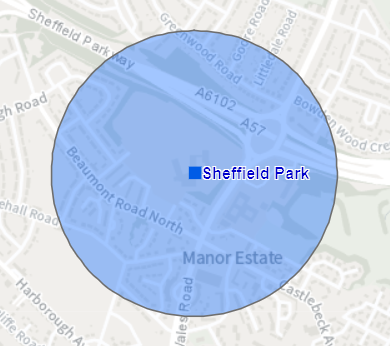
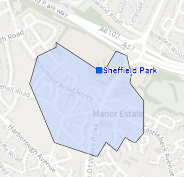

Notes on creating isochrones
================

## Introduction

As part of helping to draft a new policy we need to consider areas
within 400m of secondary schools. Buffers have previously been used for
such measurements i.e. as-the-crow-flies. However, for the draft policy
a more accurate measurement would be a 400m walk and using isochrones.
Strictly speaking a 400m distance from a school is an isodistance and a
5 minute walk is an isochrone, but the term isochrone is generally used
to cover both distance and time from a point. The diagrams below
illustrate the difference between a buffer and an isochrone:

*TODO: resize .pngs and caption*

The purpose of these notes is to understand:

1.  The best network dataset/service and software to use to create the
    isochrones.

2.  How to define the school points e.g. the main school entrance?

The best network dataset/service and software to use will be looked at
in descending order of convenience i.e. those further down the list
require more effort:

-   AGOL logistic service and ArcGIS Pro

-   openrouteservice and R

-   OS MasterMap Highways Network and Portal

-   OS MasterMap Highways Network and ArcGIS Pro

The resulting isochrones will be included in the [Portal
App](https://sheffieldcitycouncil.cloud.esriuk.com/portal/apps/View/index.html?appid=ba3cbfdb0c3642c6bfe48500b11473e9)
(requires a license and login credentials), which was created to help
draft the policy.

## Secondary schools

*TODO: get secondary school features (try AGOL before Portal) & select
just Park Academy*

## AGOL logistic service & ArcGIS Pro

*TODO: get isochrones from Portal and note from Word document*

## openrouteservice & R

The [openrouteservice R client
package](https://giscience.github.io/openrouteservice-r/index.html)
provides easy access to the
[openrouteservice](https://openrouteservice.org/) (ORS) API from R.

## OSMM Highways Network & Portal

*TODO: get OneNote isochrone notes*

## OSMM Highways Network & ArcGIS Pro

## Other options

*TODO: see takeaway bookmarks and in particular Lovelace paper*

# Appendix

## ToDo

-   Left column navigation (try [includes:
    in\_header:](https://rmarkdown.rstudio.com/github_document_format.html#Figure_Options))

-   Separate documents

## GitHub Documents

This is an R Markdown format used for publishing markdown documents to
GitHub. When you click the **Knit** button all R code chunks are run and
a markdown file (.md) suitable for publishing to GitHub is generated.

Unlike the [Notes](https://scc-pi.github.io/notes/) site, the bulk of
the rendering is done locally rather than via GitHub Actions. To some
extent this is simpler, and it also works around where rendering needs
to reference a local licensed installation of ArcGIS desktop. The site
is setup as per the basic [GitHub Pages
guidance](https://guides.github.com/features/pages). The rendering that
isn’t local uses a [Jekyll
theme](https://docs.github.com/en/pages/setting-up-a-github-pages-site-with-jekyll/adding-a-theme-to-your-github-pages-site-using-jekyll).
