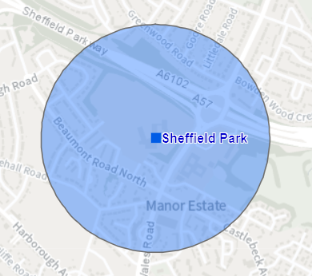
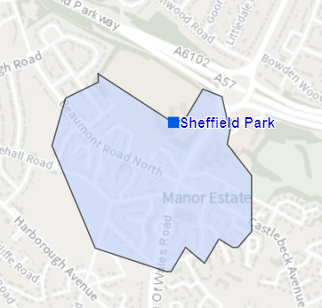

[*View source*](https://github.com/scc-pi/isochrones) {width="24"}

```{=html}
<style type="text/css">
h1.title {
  font-size: 24px;
  font-weight: bold;
}
h1 { 
  font-size: 20px;
  font-weight: bold;
}
h4.author { 
  font-size: 14px;
  font-style: italic;
}
h4.date { 
  font-size: 14px;
  font-style: italic;
}
</style>
```

```{r setup, include=FALSE}
knitr::opts_chunk$set(echo = TRUE,	message = FALSE)

library(tidyverse);library(magrittr)
library(sf); library(mapview); library(leafem); library(leaflet)
library(arcgisbinding); arc.check_product()
```

# Introduction

As part of helping to draft a new policy we need to consider areas within 400m of secondary schools. Buffers have previously been used for such measurements i.e. as-the-crow-flies. However, for the draft policy a more accurate measurement would be a 400m walk and using isochrones. The diagrams below illustrate the difference between a buffer and an isochrone:

[Buffer]{.ul}



[Isochrone]{.ul}



Strictly speaking, a 400m distance from a school is an isodistance and a 5 minute walk is an isochrone. However, the term isochrone is generally used to cover both distance and time from a point.

The purpose of these notes is to understand:

1.  The best network dataset/service and software to use to create the isochrones.

2.  How to define the school points e.g. the main school entrance?

The best network dataset/service and software to use will be looked at in descending order of convenience i.e. those further down the list require more effort:

-   AGOL logistic service and ArcGIS Pro

-   openrouteservice and R

-   OS MasterMap Highways Network and Portal

-   OS MasterMap Highways Network and ArcGIS Pro

The resulting isochrones will be included in the [Portal App](https://sheffieldcitycouncil.cloud.esriuk.com/portal/apps/View/index.html?appid=ba3cbfdb0c3642c6bfe48500b11473e9) (requires a license and login credentials), which was created to help draft the policy.

# Secondary schools

The first thing to do, is get the secondary school features we want to create isochrones for. I've made some [notes about the Council's GIS](https://scc-pi.github.io/notes/gis.html#gis), and more specifically about the [R-ArcGIS Bridge](https://scc-pi.github.io/notes/gis.html#r-arcgis-bridge) that is used below to get the data from the Council's web GIS.

```{r school-features}
# URL for secondary schools from the Council's Portal (without a token!)
secondary_schools_url  <- str_c(
  "https://sheffieldcitycouncil.cloud.esriuk.com",
  "/server/rest/services/AGOL/Education/FeatureServer/3")

# Get secondary schools as simple features with WSG84 coordinates
sf_secondary_schools <- arc.open(secondary_schools_url) %>% 
  arc.select() %>% 
  arc.data2sf() %>% 
  st_transform(crs = 4326)

# URL for the city boundary from the Council's AGOL Open Data
city_boundary_url  <- str_c(
  "https://utility.arcgis.com/usrsvcs/servers/4cdfd020c6f54581a3065c734535adab",
  "/rest/services/AGOL/OpenData/MapServer/11")

# Get the city boundary as a simple feature with WSG84 coordinates 
sf_city_boundary <- arc.open(city_boundary_url) %>% 
  arc.select() %>% 
  arc.data2sf() %>% 
  st_transform(crs = 4326)

# Plot
mapview(sf_secondary_schools, 
        layer.name = "Secondary schools", 
        label = "short_name") %>% 
  addFeatures(sf_city_boundary, weight = 2, 
              color = "black", opacity = 1, fillOpacity = 0)
```

For the purpose of comparing isochrones created from different network datasets/services and software, we'll focus on Sheffield Park Academy.

```{r park-academy}
# Get a subset of just Sheffield Park Academy as a simple feature
sf_park <- filter(sf_secondary_schools, school_org == "Sheffield Park Academy")

# Park Academy coordinates
park_coords <- st_coordinates(sf_park)

# Plot
m <- mapview(sf_park, layer.name = "Park Academy")

setView(m@map, park_coords[1], park_coords[2], zoom = 15)
```

# AGOL logistic service & ArcGIS Pro

I've added a feature layer on Portal of isochrones I created using ArcGIS Pro and the AGOL logistic service. There are some very rough notes on what I did in the [TakeawaysDataAndApp.docx](https://1drv.ms/w/s!AhGALyAD2g76ibwuUw9xeggd29iV4g?e=Coiglw) under "Appendix i) Breadcrumbs - School Isochrones".

```{r agol-pro}
# URL for secondary school isochrones from the Council's Portal (with a token!)
isochrones_url  <- str_c(
  "https://sheffieldcitycouncil.cloud.esriuk.com/server/rest/services/Hosted/",
  "Secondary_school_400m_isochrome/FeatureServer/0?token=SCuzHcThaOEkh6ewOOmp",
  "NYTOa9AckubYSesbQEF9RRM5jM5ruaWfCAkS7hRSJvwBpDtBhJbiCB_eFZH-REj9z1Tu7jOGF2",
  "-atu5AgJGrPMwm8v_VR96qjHySeRHp2hSNGXQ9pAWAu6QCTsOitAIgs_fJD5pZVw4fwxXSg0es",
  "pjtFC0l1tSnExQ2tFyA3UR5zArYLZDV_8DrwMySPs4_0rzwWR4gShptQqPErbwkY078.")

# Get secondary school isochrones as simple features with WSG84 coordinates
sf_isochrones <- arc.open(isochrones_url) %>% 
  arc.select() %>% 
  arc.data2sf() %>% 
  st_transform(crs = 4326)

# Plot
mapview(sf_secondary_schools, 
        layer.name = "Secondary schools", 
        label = "short_name") %>% 
  addFeatures(sf_isochrones, layer.name = "Isochrones") %>% 
  addFeatures(sf_city_boundary, weight = 2, 
              color = "black", opacity = 1, fillOpacity = 0)
```

Focusing on the isochrone for our example, Sheffield Park Academy:

```{r agol-pro-park}
# Get a subset of just Sheffield Park Academy isochrone as a simple feature
sf_park_isochrone <- filter(sf_isochrones, facilityid == 28)

# Plot
m <- mapview(sf_park, layer.name = "Park Academy") 

setView(m@map, park_coords[1], park_coords[2], zoom = 15) %>% 
  addFeatures(sf_park_isochrone, layer.name = "Isochrone")
```

The roundabout on Prince of Wales Road has a walkway that goes underneath it but above the Parkway. The AGOL location service hasn't included this walkway, so the isochrone stops incorrectly short of the Parkway.

# openrouteservice & R

The [openrouteservice R client package](https://giscience.github.io/openrouteservice-r/index.html) provides easy access to the [openrouteservice](https://openrouteservice.org/) (ORS) API from R.

# OSMM Highways Network & Portal

*TODO: get OneNote isochrone notes*

# OSMM Highways Network & ArcGIS Pro

# Other options

*TODO: see takeaway bookmarks and in particular the Lovelace paper*
